# Sensing and Monitoring Platform

This is a tutorial of how to use the HYPERDIDE Platform for device provisioning . To demonstrate the work of the components everything is configured locally. To start using the tutorial it is necessary to install Pre-requisites.

## Pre-requisites 
* Docker engine
* Docker compose
install jq:

```bash
sudo apt install jq
```

allow the scripts to be executed: 

```bash
chmod +x services *.sh
```
## Manual

### Start
Open the terminal and then type the command:
```bash
./services start
```
This command starts all services from the docker-compose file and run setup for the demo.

### Set of services

The picture below shows the set of services for the tutorial.
<p align="center">

</p>

### Localhost change

```bash
would you like to change the local host to a different Ip address?
If "yes" press 'y'
If "No" press 'n'
```

If you are not running the project from the local device than type "y" and then type the ip address,
else please any key and the default "localhost" will remain as it is.  


### List of the service

Here is the list of the services:
- [KeyCloak](http://localhost:8080) with login: **admin** and password: **Pa55w0rd**
- [Entirety](http://localhost:8090) with login: **n5geh** and password: **n5geh**
- [Grafana](http://localhost:3003) with login: **admin** and password: **admin**

### Initializing the services

To start using services it is MANDATORY to provide a CLIENT_SECRETS from the Keycloak Identity Manager.

#### Initializing services

Login to the Keycloak Admin dashboard via [KeyCloak](http://localhost:8080) with login: **admin** and password: **Pa55w0rd**.


#### Update client secrets for Entirety

Regenerate the Client Secret for Entirety.


Copy and past it in the bash after this message.

```bash
login to the keycloak go to down down menu 'Select reamlm' -> n5geh ->clients -> device-wizard -> Credentials re generate the 'Secret', copy  and then enter the secret key
```

#### Update client secrets for MQTT Broker

Regenerate the Client Secret for MQTT Broker.


Copy and past it in the bash after this message.

```bash
Go to the drop down menu 'Select reamlm' -> N5geh_devices ->clients -> mqtt_broker> "re generate the 'Secret', copy and then enter the secret key
```
## Entirety

### Login page

Now, the ENTIRETY service should be available via this [Entirety](http://localhost:8090) with login: **n5geh** and password: **n5geh**.


### Dashboard
Here is a ENTIRETY Dashboard with Register Classes

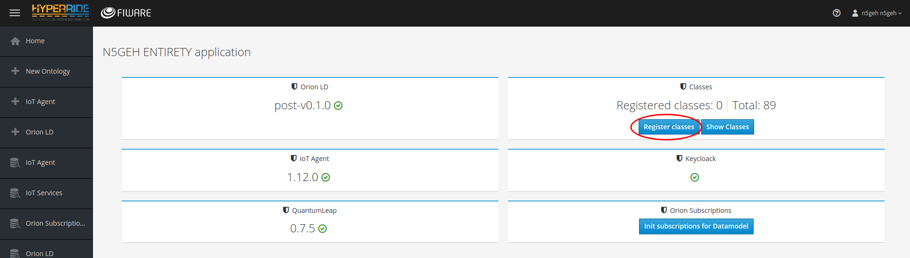
Success
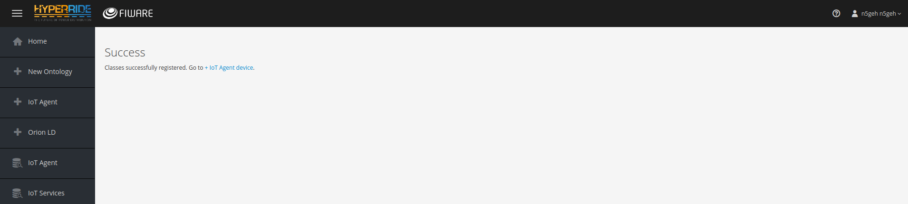


### Initialize subscriptions


### Notifications


### Add/Remove device

Entirety supports two type of Datamodel definition: NGSIv2 and NGSI-LD.
Because IoT Agent currently does not support NGSI-LD than in this tutorial we are showing an example with NGSIv2.

Here is definition of the Meter in the Datamodel:
```javascript
{
  "base_template": "base/Device.json",
  "device_id": {
    "name": "device_id",
    "label": "Device Id",
    "required": "true",
    "prefix": "urn:ngsi-ld:Meter:"
  },
  "entity_name": "",
  "entity_type": "Meter",
  "attributes": [
    {
      "object_id": "nam",
      "name": "name",
      "type": "String"
    },
    {
      "object_id": "lis",
      "name": "listening",
      "type": "String"
    }
  ],
  "commands": [],
  "static_attributes": [
    {
      "name": "subCategory",
      "label": "Sub Category",
      "type": "Property",
      "value": "GridRelated",
      "required": "true"
    },
    {
      "name": "hasChannel",
      "label": "Channel",
      "type": "Relationship",
      "value": "",
      "query": "Channel",
      "required": "true"
    },
    {
      "name": "isMeasuredIn",
      "type": "Relationship",
      "label": "Measure",
      "value": "",
      "query": "Measurement",
      "required": "true"
    }
  ]
}
```
And also definition of Device (base object for all devices).
```javascript
{
  "protocol": "",
  "timezone": "",
  "attributes": [
    {
      "object_id": "crA",
      "name": "createdAt",
      "type": "datetime"
    },
    {
      "object_id": "moA",
      "name": "modifiedAt",
      "type": "datetime"
    },
    {
      "object_id": "cat",
      "name": "category",
      "type": "String"
    }
  ],
  "static_attributes": [
    {
      "name": "hasState",
      "type": "Relationship",
      "label": "State",
      "query": "State",
      "required": "true"
    },
    {
      "name": "controlsProperty",
      "type": "Relationship",
      "label": "Property",
      "query": "Property",
      "required": "true"
    },
    {
      "name": "isMeasuredIn",
      "type": "Relationship",
      "label": "Measurement",
      "query": "Measurement",
      "required": "true"
    },
    {
      "name": "hasCommand",
      "type": "Relationship",
      "label": "Command",
      "query": "Command",
      "required": "true"
    },
    {
      "name": "hasFunction",
      "type": "Relationship",
      "label": "Function",
      "query": "Function",
      "required": "true"
    },
    {
      "name": "conssistOf",
      "type": "Relationship",
      "label": "Consist of",
      "query": "",
      "required": "false"
    }
  ]
}
```
Entirety uses this data to prepare the web form and generate final object for the device.
Here is an example of registering the device.


### Services


## Entirety 2.0

### Show classes
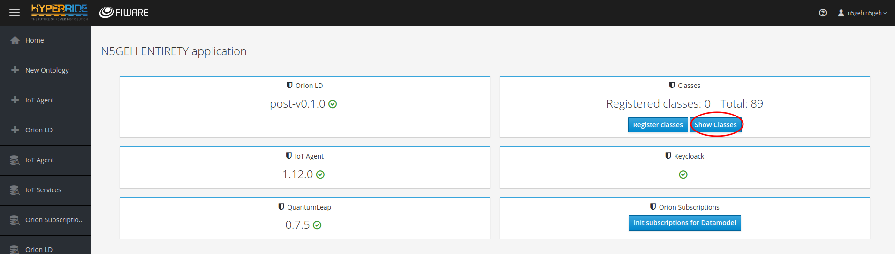

### Classes shown as a list
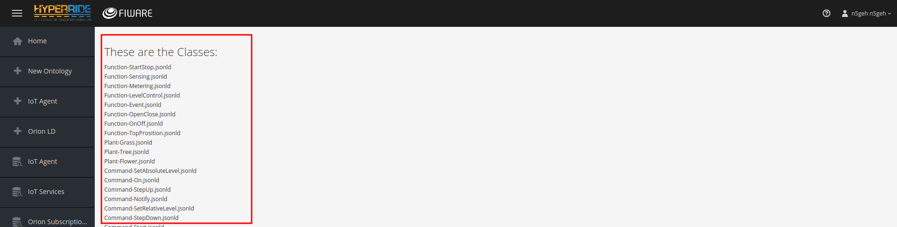

### Add or Edit an IoT Agent
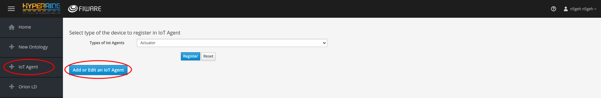

Process
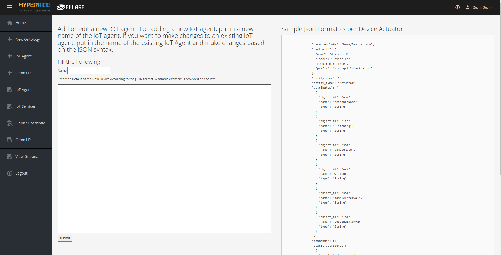
Fill in with new IoT Agent Name and then submit
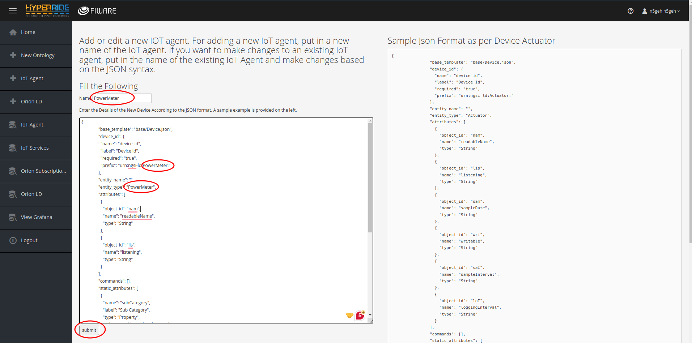

New Iot Agent is Avaiable in the Types dropdown list
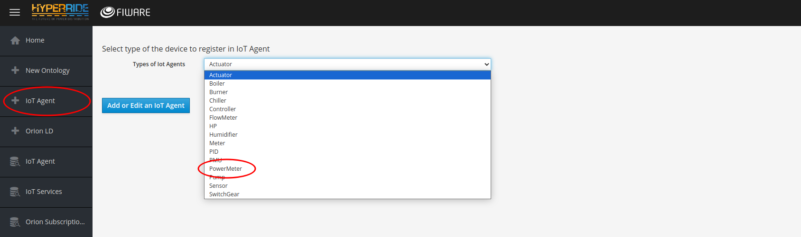

### Change IoT Agents and it parameters Based on Ontology
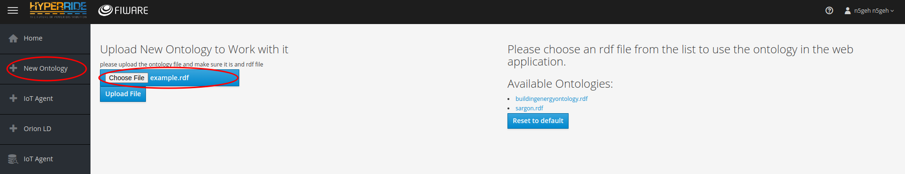

### Upoad success
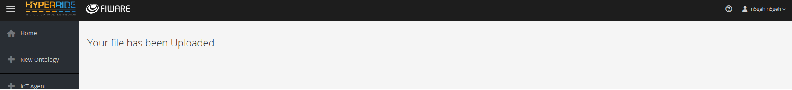

### Choose Ontology
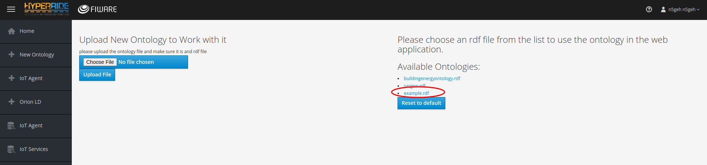
Ontology Looks like this:
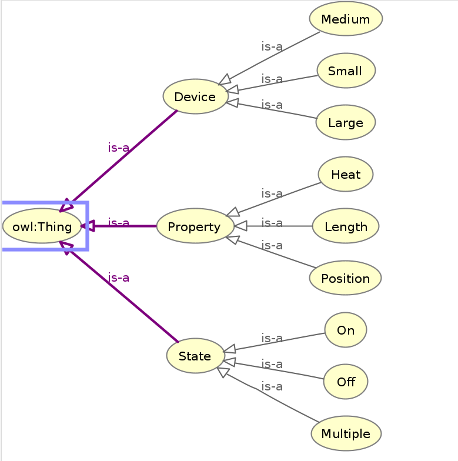

### RDF file shown below
```rdf
<?xml version="1.0"?>
<rdf:RDF xmlns:rdf="http://www.w3.org/1999/02/22-rdf-syntax-ns#"
         xmlns:rdfs="http://www.w3.org/2000/01/rdf-schema#"
         xmlns:owl="http://www.w3.org/2002/07/owl#"
         xmlns:ex="http://www.example.org/sample-ontology#">

    <!-- State classes -->
    <owl:Class rdf:about="http://www.example.org/sample-ontology#State"/>
    <!-- On -->
    <owl:Class rdf:about="http://www.example.org/sample-ontology#On">
        <rdfs:subClassOf rdf:resource="http://www.example.org/sample-ontology#State"/>
    </owl:Class>
    <!-- Off -->
    <owl:Class rdf:about="http://www.example.org/sample-ontology#Off">
        <rdfs:subClassOf rdf:resource="http://www.example.org/sample-ontology#State"/>
    </owl:Class>
    <!-- Multiple -->
    <owl:Class rdf:about="http://www.example.org/sample-ontology#Multiple">
        <rdfs:subClassOf rdf:resource="http://www.example.org/sample-ontology#State"/>
    </owl:Class>

    <!-- Property classes -->
    <owl:Class rdf:about="http://www.example.org/sample-ontology#Property"/>
    <!-- Heat -->    
    <owl:Class rdf:about="http://www.example.org/sample-ontology#Heat">
        <rdfs:subClassOf rdf:resource="http://www.example.org/sample-ontology#Property"/>
    </owl:Class>
    <!-- Position -->
    <owl:Class rdf:about="http://www.example.org/sample-ontology#Position">
        <rdfs:subClassOf rdf:resource="http://www.example.org/sample-ontology#Property"/>
    </owl:Class>
    <!-- Length -->
    <owl:Class rdf:about="http://www.example.org/sample-ontology#Length">
        <rdfs:subClassOf rdf:resource="http://www.example.org/sample-ontology#Property"/>
    </owl:Class>

    <!-- Device classes -->
    <owl:Class rdf:about="http://www.example.org/sample-ontology#Device"/>
    <!-- Large -->    
    <owl:Class rdf:about="http://www.example.org/sample-ontology#Large">
        <rdfs:subClassOf rdf:resource="http://www.example.org/sample-ontology#Device"/>
    </owl:Class>
    <!-- Small -->
    <owl:Class rdf:about="http://www.example.org/sample-ontology#Small">
        <rdfs:subClassOf rdf:resource="http://www.example.org/sample-ontology#Device"/>
    </owl:Class>
    <!-- Medium -->
    <owl:Class rdf:about="http://www.example.org/sample-ontology#Medium">
        <rdfs:subClassOf rdf:resource="http://www.example.org/sample-ontology#Device"/>
    </owl:Class>

    <!-- Property definitions -->
    <owl:ObjectProperty rdf:about="http://www.example.org/sample-ontology#hasColor">
        <rdfs:domain rdf:resource="http://www.example.org/sample-ontology#State"/>
        <rdfs:range rdf:resource="http://www.w3.org/2001/XMLSchema#string"/>
    </owl:ObjectProperty>
    <owl:ObjectProperty rdf:about="http://www.example.org/sample-ontology#hasValue">
        <rdfs:domain rdf:resource="http://www.example.org/sample-ontology#State"/>
        <rdfs:range rdf:resource="http://www.w3.org/2001/XMLSchema#string"/>
    </owl:ObjectProperty>
</rdf:RDF>
```
The IoT agent type list changes based on the ontology
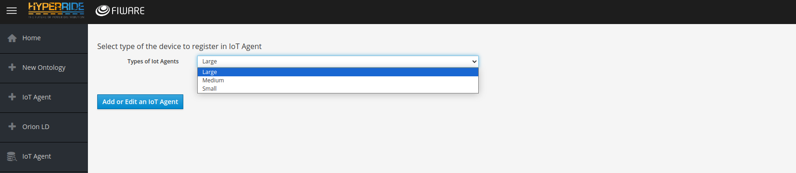

Device Form changes as well
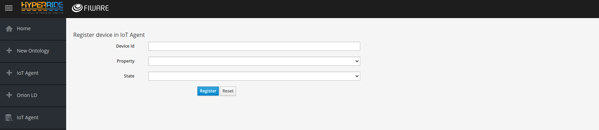


### Crate DB Database
New table will be added as shown


### Send a MQTT message

According to registered device:

* Username **urn:ngsi-ld:meter:meter001**
* Password **secret**
* Topic **/n5geh3c4d3da22af22bb6/urn:ngsi-ld:Meter:meter001/attrs**

In this tutorial we are using IoT Agent UL version and uploading data from CSV file.

```python
#!/usr/bin/env python3

import paho.mqtt.client as mqtt
import pandas as pd
import time

df = pd.read_excel('Switchgear1.xls')
df["Timestamp"]=pd.to_datetime(df.Timestamp)
col_name=[]

for col in df.columns:
    col_name.append (col)
col_name = col_name[:-2]

for index, row in df.iterrows():
    client = mqtt.Client()
    client.username_pw_set("urn:ngsi-ld:meter:meter001", "secret")
    client.connect("137.226.248.224", 1883, 60)
    client.publish("/n5geh3c4d3da22af22bb6/urn:ngsi-ld:Meter:meter001/attrs", "dvP|{}|dvM|{}|dc1P|{}|dc1M|{}|dc2P|{}|dc2M|{}|dc3P|{}|dc3M|{}|dc4P|{}|dc4M|{}".format(
        int(row[col_name[1]]),
        int(row[col_name[2]]),
        int(row[col_name[3]]),
        int(row[col_name[4]]),
        int(row[col_name[5]]),
        int(row[col_name[6]]),
        int(row[col_name[7]]),
        int(row[col_name[8]]),
        int(row[col_name[9]]),
        int(row[col_name[10]]),
    ));
    client.disconnect();
    count= index+1
    print (count," row inserted in the table")
    time.sleep(3)
    if count == 10:
        break
```

#### Data

The data goes to the CrateDB and stores in the table 'mtopeniot.etmeter'.


### Grafana
The Grafana tab opens a new tab of Grafana login page
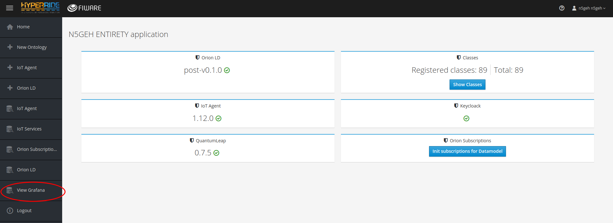


Put the parameters in accordingly in the query table:


And the data can be visualised as shown below:


### Stop

To stop the tutorials please run following command:

```bash
./services stop
```
### Citation

https://github.com/N5GEH/n5geh.tools.entirety
  
https://github.com/N5GEH/n5geh.tutorials.entirety_step_by_step

### Solution for error

If CrateDB exits immediately with a max virtual memory areas vm.max_map_count [65530] is too low, increase to at least [262144] error


Solution: sudo sysctl -w vm.max_map_count=262144